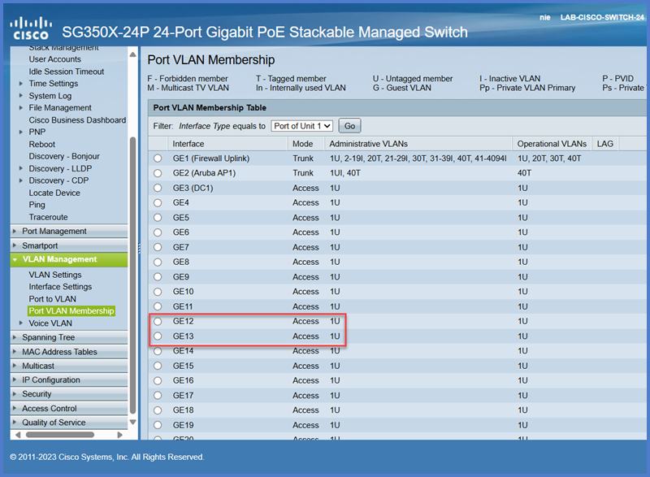

# Lab 2: Adding Devices to the Network

In this lab, you will work to restore a switch using your previous lab config file, you'll add additional endpoints to the network, test connections using the `ping` network utility, and test your VLAN tagging knowledge!

## Prerequisites

- Familiarity with VLAN concepts and switch port configurations.  
- GUI access to a managed switch (e.g., {{ extra.devices.cisco_switch.type }}).  
- Two Endpoint devices - You may use your laptop as well as **{{ devices.pc01.name }}** (bottom shelf of rack).

!!! tip "Key Concepts for Lab"
    VLAN tagging separates network traffic into logical segments, improving security and performance.  
    You'll be working with the following VLANs:
    
      
    - **{{ vlan.name }}**: {{ vlan.description }} ({{ vlan.subnet }})
    

---

## Task 1: Restore the Switch Configuration from Backup

!!! question "Why Restore Configuration?"  
    Restoring a configuration ensures your switch has the desired settings without manually reconfiguring everything. 
    
    Aside from being **much** faster to restore this way, it also provides some peace of mind knowing that everything is restored exactly as it had been previously, and no wondering in the middle of the night if you remembered to tag the port for that one computer in that one office for that one user that always complains - _what port what that plugged into again?_

1. **Access the Switch GUI**  
    - Open your browser and navigate to the management IP: `{{ extra.devices.cisco_switch.default_ip }}`.  
    - Use the credentials below:  
        - Username: `{{ extra.devices.cisco_switch.default_user }}`  
        - Password: `{{ extra.devices.cisco_switch.default_pass }}`  

!!! tip "Don't forget your NIC adapter settings. If your NIC is configured correctly and you still can't access it on the default IP, then you may need to factory reset it. Revisit the [cisco setup guide](cisco-switch-setup.md) if you need a refresher."

2. **Locate Backup/Restore Settings**  
    - Navigate to `Administration → File Management → File Operations`.  
    - Select the **Update File** option.

3. **Upload Backup File**  
    - Choose the backup file from your local machine or your USB inserted into the switch.  
    - Choose **Running Configuration** for the destination.  
    - Click **Apply** and confirm the restore process.

4. **Reconnect to Switch**  
    - **Update** your **NIC settings** and **reconnect** to the switch with:  
        - IP Address: `{{ devices.cisco_switch.ip }}`  
        - User: `{{ devices.cisco_switch.custom_user }}`  
        - Password: `{{ devices.cisco_switch.custom_pass }}`

!!! tip "Save Your Work"  
    After restoring the configuration, ensure you save it to the startup configuration or else a reboot will wipe your config!

---

## Task 2: Connect More Endpoints


1. Power on **{{ devices.pc01.name }}** and **Sign In**  
    - Plug **Power** into **{{ devices.pc01.name }}**.  
    - Plug in the **Display Cable** between **{{ devices.pc01.name }}** and the monitor.  
    - Plug the **Ethernet** cable into **{{ devices.pc01.name }}** and into `GE13` _(bottom-left)_ of **{{ devices.cisco_switch.name }}**.  
    - Sign into **{{ devices.pc01.name }}** with the following credentials: `{{ devices.pc01.user_account }}`.

2. **Update Network Settings**  
    - Update the NIC so that it can communicate with the switch.  
    - Set the IP Address within the {{ vlans.lan.name }} subnet _({{ vlans.lan.subnet}})_. This exercise will use `192.168.10.13` for this example, feel free to use the same and follow along.

---

## Task 3: CMD and Conquer

1. **What's my IP?**

    - Press `Windows Key + X` and select **Terminal**.  
    - Type `ipconfig` and hit **Enter**.  
    - **Verify** the Ethernet Adapter has the proper **IPv4** and **Subnet Mask** configured.

2. **Ping the Switch**

    !!! tip "Can you hear me now?"  
        The `ping` command is one of the most commonly used network utilities for troubleshooting. This command sends a series of network packets to a designated IP or host in order to check if they can "talk" to one another. It's mostly used to verify that another device is online, and that the devices can establish a connection between one another.

        💡**Tip:** By default `ping` only sends 4 packets then stops, but using `ping -a` creates a **rolling ping** that runs continuously until stopped with `ctrl+c`. This can be helpful when rebooting a server as it allows you to start a rolling ping against it to monitor the reboot progress and verify when it's back up.

        [📚Read more about Ping](https://learn.microsoft.com/en-us/windows-server/administration/windows-commands/ping)

    - In the **terminal**, type `ping {{ devices.cisco_switch.ip }}` and hit **Enter**.
    
    If you were successful, then you should see 4 packets sent successfully to the switch. Each reply gives you the amount of time in milliseconds _(ms)_ that it took to send a packet to the switch and receive an "alive" response.


```
C:\Users\LabUser>ping 192.168.10.2

Pinging 192.168.10.2 with 32 bytes of data:
Reply from 192.168.10.2: bytes=32 time=2ms TTL=64
Reply from 192.168.10.2: bytes=32 time=4ms TTL=64
Reply from 192.168.10.2: bytes=32 time=3ms TTL=64
Reply from 192.168.10.2: bytes=32 time=5ms TTL=64

Ping statistics for 192.168.10.2:
Packets: Sent = 4, Received = 4, Lost = 0 (0% loss),
Approximate round trip times in milli-seconds:
Minimum = 2ms, Maximum = 5ms, Average = 3ms
```


!!! warning  
    `ping`, also known as **ICMP** traffic, may sometimes be blocked on purpose. Administrators may not want you to know if their infrastructure responds to pings. As useful as `ping` is, it can also be equally destructive when used maliciously. So while generally you can use it to test connectivity, please know that it's not 100% accurate as the other device may have ICMP disabled or a device's built-in firewall may block it.  

---

## Task 4: Verify Configuration and Test


1. **Access the VLAN Configuration Menu**  
    - On the switch GUI, navigate to **VLAN Management → VLAN Settings**.  
    - Review the current VLAN configuration to ensure the necessary VLANs have been created. You should already have the following VLANs configured:

      
      **VLAN {{ vlan.id }} - {{ vlan.name }}** ({{ vlan.subnet }})
      

2. **Test Connectivity through Switch**
    - **VLAN Management → Port VLAN Membership**
    - **Your laptop** (`GE12`) should be assigned to the **{{ vlans.lan.name }}** VLAN with an **access port**.  
    - **{{ devices.pc01.name }}** (`GE13`) should be assigned to the **{{ vlans.lan.name }}** VLAN with an **access port**.



3. **Ping away**  
    - Both of our devices should be able to communicate with one another, so let's `ping` from your laptop to **{{ devices.pc01.name }}**.
    - Now the reverse: `ping` from your **{{ devices.pc01.name }}** to your laptop.

    Hopefully your ping was successful like the ones below! Some common issues may be switch configuration, Windows firewall blocking ICMP, and never forget to double check your cables even if you think you plugged everything in correctly!

```
C:\Users\YourName>ping 192.168.10.13

Pinging 192.168.10.13 with 32 bytes of data:
Reply from 192.168.10.13: bytes=32 time=1ms TTL=128
Reply from 192.168.10.13: bytes=32 time=1ms TTL=128
Reply from 192.168.10.13: bytes=32 time=1ms TTL=128
Reply from 192.168.10.13: bytes=32 time=1ms TTL=128

Ping statistics for 192.168.10.13:
    Packets: Sent = 4, Received = 4, Lost = 0 (0% loss),
Approximate round trip times in milli-seconds:
    Minimum = 1ms, Maximum = 1ms, Average = 1ms
``` 


## Task 5. Break the Connection

We know we have a connection established, but let's try to test our VLAN knowledge and break the connection. Let's pretend **{{ devices.pc01.name }}** is a security camera server and needs to be **isolated to the {{ vlans.security.name }}** VLAN so that other network traffic can't communicate with it.

- Navigate back to **{{ devices.cisco_switch.name }}** and update `GE13` so that the access VLAN is `{{ vlans.security.id }}` and **apply** your changes.

!!! question "Think about it..."  
    What did we just do?  

    Currently **{{ devices.pc01.name }}** is plugged into `GE13` as an **access** port so it can only communicate on one VLAN, which we've now updated to VLAN `{{ vlans.security.id }}`. So in theory, **{{ devices.pc01.name }}** can only communicate on the `{{ vlans.security.subnet }}` network now.  

    What's going to happen when we `ping` the switch? Will it still work?

- From **{{ devices.pc01.name }}** try to `ping` **{{ devices.cisco_switch.name }}** on {{ devices.cisco_switch.ip }}


**Did you guess it right?!**

- **{{ devices.pc01.name }}** can only communicate on the `{{ vlans.security.subnet }}` network, but **{{ devices.cisco_switch.name }}** is not in that subnet, and therefore can't communicate. Even if we _could_ communicate, we never updated our NIC settings on **{{ devices.pc01.name }}** to reflect the new subnet, so **{{ devices.pc01.name }}** likely has a "No Network" symbol and can't connect to _any_ network currently. 

You could go update the NIC on **{{ devices.pc01.name }}** to be in the correct subnet, but it would be no help in this current lab. To communicate between VLANs we need something to route those requests on the Layer 3 network. Something like a **{{ devices.firewall.type }}**! We'll come back to more advanced VLAN configurations once we get our firewall configured in the next lab.

---

## Task 5: Cleanup The Lab

2. **Reset Equipment to Factory Defaults**  
    - Ensure **{{ devices.cisco_switch.name }}** has been factory reset and is ready for the next lab user. No need to save our config from this lab!

3. **Power Off Devices**  
    - Take a moment to power down **{{ devices.pc01.name }}** gracefully. The remaining hardware can be turned off via the single Red power toggle on the PDU.

4. **Clean Up and Organize**  
    - Please take a moment to organize the cables and equipment you used for this lab. Ensure it's ready for the next user!
