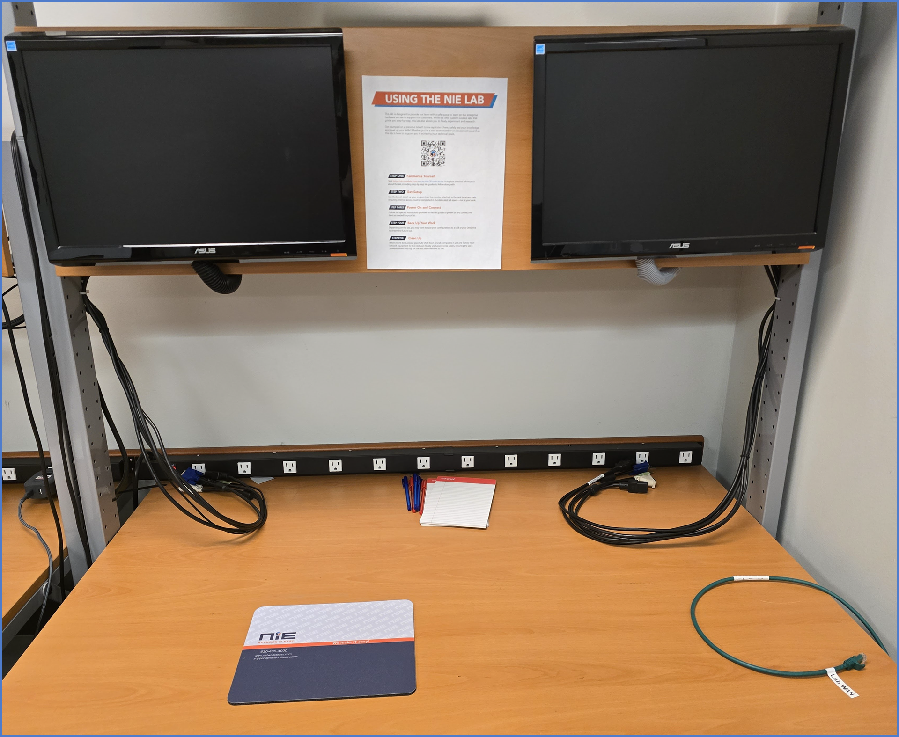

# Networking Lab Overview  

Welcome to our **Networking Labs**—a hands-on environment designed to help you sharpen your networking skills and explore NIE’s operations in a controlled, safe space. From configuring firewalls and switches to implementing VLANs for VoIP or troubleshooting network issues, this lab empowers you to experiment freely. Reset configurations and practice as much as you like!  

!!! tip "Test, Test, and Test Again!"  
    This is a **safe space to fail and learn**, so step outside your comfort zone and dive in! Here you can make changes without fear of bringing down the network or causing unexpected issues. Go ahead—break it and figure out how to fix it!

 

## Equipment in the Rack  

Our lab is housed in a compact, rolling 12U rack that is located in the back of our office within the Lab area. There is a dedicated lab bench next to the network rack that has monitors attached with necessary cabling to run two endpoints simultaneously. In addition to the rack and bench, the area also has the only Lab WAN Uplink in the office, so **any labs that require Internet will need to be performed near the dedicated lab bench**. 

The rack is on wheels, so once you gain a baseline understanding of how it all works, you'll also be able to roll it to your desk to work on labs that do not require Internet. We are continuing to work on our lab and add equipment, but here is a good breakdown of our core hardware: 

- **PDU (Power Distribution Unit):** Powers all devices in the rack.  
- **WatchGuard T45:** Firewall appliance for network security and routing.  
- **Cisco SG350X-24P:** Managed switch ideal for more robust network configurations.  
- **Aruba Instant On 1930-24P:** Cloud managed switch perfect for SMB network setups.  
- **Aruba Instant On AP22:** Cloud managed wireless access point that enables Wi-Fi connectivity.  
- **Windows Endpoints:** Dedicated Lab PC's used to connect to hardware, configure equipment, and test connectivity.
- **Monitor:** Attached is a 24" monitor that you can use when the lab is "mobile" and away from the dedicated lab bench.  

  

---

## How to Use the Lab  

Each lab will provide you with the specific instructions to complete that lab, but below is **general** information about getting setup.

1. **Getting Ready**  
    - **Update your Teams status** to let your teammates know you are working on labs and move to the back room.
    - Ensure it’s stable and positioned conveniently, but out of the way of others. _You may need to unlock the caster wheels on the front of the rack if you need to reposition the rack._

2. **Power It On**  
    - Plug the single **PDU power cable** into a wall outlet to provide power to the entire rack. _You may need to open the plastic cover and flip the red master switch on the PDU._

3. **Connect Your Laptop**  
    - Use the provided **blue Ethernet cables** to connect your laptop or other endpoints to the lab. Each specific lab will give you more information on how to get connected. If you need additional cables please let someone know.

    !!! danger "Connecting the Lab to Internet"  
        **Internet Access:** Not all of our labs require Internet access. If a specific lab calls for Internet or you need to test with Internet, please be sure to connect the firewall WAN into the dedicated and labeled **Green (Lab WAN Uplink) Ethernet Cable** in the back room! **Please do NOT plug any part of the lab into the existing office network.**

4. **Save Your Work**  
    - Some of our labs will continuously build onto one another, so having a defined placed to store your configuration files will be important. We recommend saving them to your **OneDrive** or to a dedicated **USB drive**.  
    - By doing this, you'll be able to quickly restore your previous configurations and pick up exactly where you left off last time!

5. **Clean Up**  
    - Remove the **blue Ethernet cables** connecting your laptop or other endpoints.  
    - Leave the infrastructure connected _(e.g., switches, firewall, AP)_.  
    - Power off devices and neatly organize cables. Leave the rack ready for the next person!  

6. **Report Lab Issues**  
    - Please use the **[feedback](../../feedback.md)** option along the top of the navigation menu to report any issues you encountered with the lab or submit new suggestions.

---

## Tips for Success

- **Experiment Freely**: Feel confident resetting and reconfiguring devices without consequence.  
- **Learn Actively**: Take advantage of our hands-on learning and comfortable configuring enterprise hardware. 
- **Seek Support**: Your manager and peers are here to assist you when needed. Just give us a shout!  
