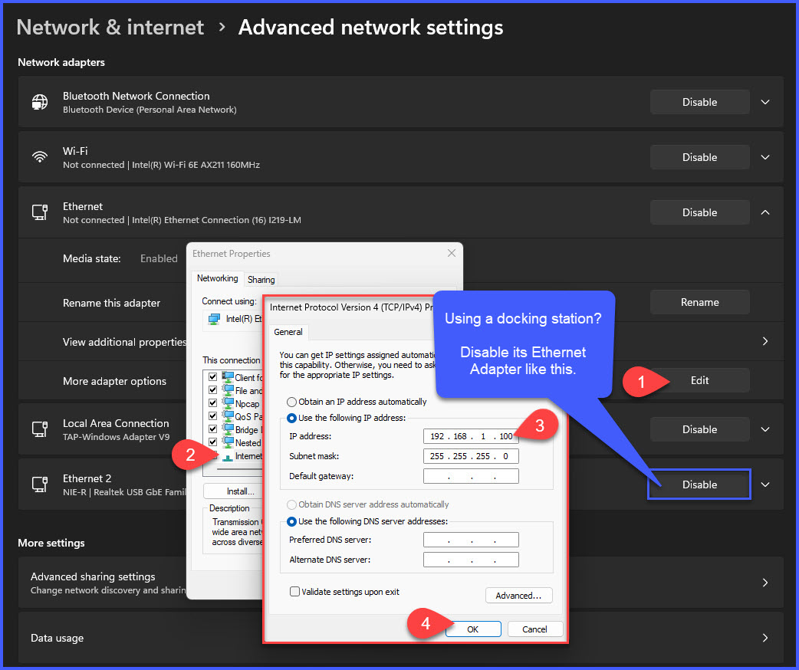

<!-- To Fix

- Add generic instructions for configuring NIC. Might be best to add into a main page and link to it for multiple uses. Mention disabling dock if using on dock.

- Add ipconfig /all screenshots and steps when needed to help drive troubleshooting

- Get Lab Sharepoint setup for Files

 -->

# Lab 1: Setting Up a {{ devices.cisco_switch.type }}
## Overview 🔎

This lab guides you through the complete setup process of a **{{ devices.cisco_switch.type }}** using its web GUI. By the end of this lab, you'll have configured the switch, saved and backed up its configuration, and tested factory reset and restoration.

⚡ **Before You Begin:**  

- Access to the {{ devices.cisco_switch.type }} **(_{{ devices.cisco_switch.name }}_)**.  

- A PC to connect to the switch for accessing the web GUI. 

- A USB or PC to save and restore configuration files to and from.

---

## 1. Initial Setup - NIC Configuration and Reset ⚙️

In most environments you will have a **DHCP server** _(firewall or DC typically)_ that hands out IP addresses when a device plugs into the network. Without one, **we'll have to assign our own IP address**. Cisco switches have a default IP address of `192.168.1.254` so we need to ensure our new IP is in the same subnet so that we can communicate.

On Windows 11 you can update your NIC by going to `Settings > Network & Internet > Advanced Network Settings` then expand your built-in Ethernet adapter and edit the IPv4 Properties.

- Set your NIC IP to `192.168.1.100` and ensure the subnet mask is `255.255.255.0` and **save**. 

!!! tip
    **If you are also plugged into a docking station**, then please temporarily **disable** your additional Ethernet Adapter(s) so that traffic doesn't get mistakenly routed through them. You can re-enable them at the end of the lab.

!!! note

    Because we're plugged directly into the switch we can communicate on the **Layer 2 (L2) network**, therefore we do not need a router, or default gateway, to route our network requests. We're going to be navigating Web GUIs directly by IP Addresses so we have no need for DNS servers either - We can leave both sections blank for this lab!

    [_Layer 2 or Layer 3 - What's the Difference?_ from **Auvik**📜](https://www.auvik.com/franklyit/blog/layer-3-switches-layer-2/)

---

## 2. Connect to the Switch 🔄

- **Ethernet Connection**: Connect your computer to the {{ devices.cisco_switch.type }} via an Ethernet cable into port `GE12` (top-right).
- **Access the Switch**: Open a browser and visit `192.168.1.254`.
- **Login**: Use the default credentials: (`{{ devices.cisco_switch.default_user }} / {{ devices.cisco_switch.default_pass }}`) 🔑.
- **Change Password**: Please update the password to something secure, such as `{{ devices.cisco_switch.custom_pass }}`.

⚠️ Usernames and passwords are **case sensitive**, so be careful what you type!

!!! danger "Oops! No access? 😬"
    If you can’t get in, perform a factory reset! **Here’s how:**
    
    Use a **paperclip** or another object to **carefully** press and hold the reset button on the front of the switch for **15-20 seconds**, then release. For more help, check out the [Cisco Reset Guide](https://www.cisco.com/c/en/us/support/docs/smb/switches/cisco-350-series-managed-switches/smb985-how-to-manually-reboot-or-reset-a-switch.html).

---

## 3. Add User and Update Settings 🧑‍💻

**Add User**:

  - Go to `Administration > User Accounts > Add`.
  - Create a user with these details:
    - **Username**: `{{ devices.cisco_switch.custom_user }}`
    - **Password**: `{{ devices.cisco_switch.custom_pass }}`
    - **Level**: `15`
  - **Note**: Make sure the user has full administrative rights (Level 15) to make all necessary configuration changes. 🛠️

**System Settings**:

  - Go to `Administration > System Settings`.
  - Set the **System Location** to `5400 Patton Dr. Unit 4A, Lisle, Illinois 60532`.
  - Set the **Contact** to `support@networkiteasy.com`.
  - Change the **Host Name** to **User Defined** and give it a new name: `{{ devices.cisco_switch.name }}`
  - Set a **Login Banner** and **Welcome Banner** (you can use the same text): `{{ devices.cisco_switch.banner }}`.
  - Click **Apply**.

**Time Settings**:

  - Go to `Administration > Time Settings > System Time`.
  - Configure the time zone under **Manual Settings** by using the `Click Here` button to import from your computer.
  - Click **Apply**.

!!! note "Why not use SNTP?"
    In most cases it would probably make sense to configure SNTP servers for keeping time up-to-date. This allows the switch to check in with public servers whose sole purpose is keeping track of time. In this lab we won't have an outside Internet connection to reach the public servers, but be sure to try this out in future labs.

---

## 4. Save Configuration 💾

!!! tip "🛠️ Running and Startup Configurations with Cisco Switches"

    When working with Cisco switches, understanding the distinction between **running** and **startup configurations** is critical for managing and preserving network settings effectively.

    ---

    🔄 The **running configuration** refers to the current settings actively applied to the switch. Any changes you make—whether via CLI or the Web GUI—are reflected here immediately. However, these changes are temporary and exist only in the switch’s **RAM**. If the switch is restarted or powered off, the running configuration is erased.

    💾 The **startup configuration** is the saved version of your settings stored in **NVRAM** (non-volatile memory). This configuration persists across reboots and is loaded automatically when the switch powers on.

🔑 **Saving Changes in the Web GUI**

To ensure your changes are preserved after a reboot, you must save the **running configuration** to the **startup configuration**. Along the top of the Web GUI you’ll notice a flashing **Save Icon** (💾) prominently displayed. Clicking this icon saves your current running configuration to NVRAM, effectively committing the changes as the new startup configuration.

💡**Bailout Strategy**:
If a configuration change may cause an issue, restarting the switch without saving allows it to revert to the last saved **startup configuration**, effectively bailing you out. This can be used in some scenarios to your benefit if planned accordingly!

## 5. Firmware Upgrade 🔧

- Search for the latest firmware version for your Cisco switch on Google or use the firmware provided in the lab files. Be sure to download firmware from Cisco's website only.
- Navigate to `Administration > File Management > Firmware Operations`.
- Click **Update Firmware**, browse to the folder containing the firmware on your PC and apply the upgrade. If you are using a USB, then it needs to be on the root of the drive. 🚀

---

## 6. Configure IP Address 🌍

- Navigate to `IP Configuration > IPv4 Management and Interfaces > IPv4 Interface`.
- Add the new Static IP address and **Apply** the details below:
    - **IP Address**: `{{ devices.cisco_switch.ip }}`
    - **Network Mask**: `{{ devices.cisco_switch.subnet_mask }}`

- Click **OK** through the popup. The switch will now lose connection as it updates to the new IP address.
- Update your NIC adapter settings to a compatible address within the same subnet (e.g., `192.168.10.100`).
- Re-navigate to the switch's new IP (`{{ devices.cisco_switch.ip }}`) and log in again.

- **Save Config**: Don’t forget to save your changes! 💾

---

## 7. Name Critical Interfaces 🔌

!!! note "But do we have to?"
    I'm sure you've worked a ticket before where you _**really**_ wished someone labeled which port some critical device was plugged into. 

    Take a few minutes now to get these critical ports updated with a brief description. It'll make your life easier later on, or better yet, maybe you'll **save your teammates day in the future!**⭐ Our lab doesn't have much at all, but good examples would be: descriptive message about uplinks between infrastructure _(firewalls, access points, switches, servers, printers, UPS)_, specific phones like 'reception', or any unique and customer-specific infrastructure that would be cause for an emergency if it went down on a weekend.

- Go to `Port Management > Port Settings`.
- Click the radio button for **GE1** and scroll down to the bottom of the page then select **edit**. 
- Set the Description to `{{ devices.firewall.name }}` and click **Apply**.
- You can switch ports from within the window by selecting them in the Port dropdown at the top. **Update and Apply** the descriptions for each of the remaining ports below:
    - **GE2**: `{{ devices.ap01.name }}`.
    - **GE3**: `{{ devices.dc01.name }}`.
    - **GE24**: `{{ devices.aruba_switch.name }}`.

- Click **Close** when the critical ports have all benn renamed. 🔧

---

## 8. Add VLANs 🖧

Navigate to `VLAN Management > VLAN Settings > Add`.

For each VLAN, enter the following configuration:

| **VLAN Name** | **VLAN ID** |
|---------------|-------------|

| {{ vlan.name }} | {{ vlan.id }} |


Click **Apply** and save the configuration. 💾

!!! tip "VLAN 1 is configured by default."

---

## 9. Auto Voice VLAN and Smartport ☎️

- Navigate to `VLAN Management > Voice VLAN > Properties`.
- Set the **Voice VLAN ID** to `{{ vlans.voip.id }}` and click **Apply** and **OK**.
- Go to `Smartport > Properties`.
- Set **Smartport** to `enabled by Auto Voice VLAN`.

---

## 10. Access vs Trunk Ports 🌐

!!! note "**What's the difference between the two?**💡"

    - **Access Ports**: Used for devices that only need to communicate with a **single VLAN or network**. Common use cases would be workstations that only need to communicate on the main LAN, or security cameras that should only be accessible on the security VLAN. Most ports should be configured to **Access** typically unless needed otherwise.

    - **Trunk Ports**: Configuring trunk ports allows the connected device to communicate with **multiple VLANs**. This is used for linking infrastrucutre together such as switches, access points, etc. For example, when linking switches together, they typically need to be made aware of **all possible VLANs** so you'd need to configure a **Trunk** port on each switch.    Another common **Trunk** example is when customers have Voice VLANs and PBX servers - you can leverage a trunk port so that the physical VoIP phone or handset can be plugged into the main Voice VLAN, but can tag the Lan VLAN on the switchport as well so that the phone can passthru the main Lan connection to a PC for it to communicate.

- Navigate to `VLAN Management > Interface Settings`.
- **Select** the following interfaces and **edit** them to **Trunk** and **Apply**:
    - **GE1**: `{{ devices.firewall.name }}`.
    - **GE2**: `{{ devices.ap01.name }}`.
    - **GE24**: `{{ devices.aruba_switch.name }}`.

## 11. Tagging VLANs 🏷️
!!! tip "These can be hard to keep straight!"
    **Untagged / Native VLAN**: You will hear these terms often used interchangeably. The untagged, or native VLAN, dictates what network the device will be assigned to.
    
    **Tagged VLANs**: In cases where a port is configured as a **Trunk port**, you can tag additional VLANs that the port needs to communicate with. The device will be assigned to the untagged/native VLAN, but can **communicate with other VLANs that have been tagged**. In the above example of linking switches together, you would configure the Untagged/Native VLAN to 1 so that it's accessible on the main LAN, but then tag all other VLANs so that it can "passthru" the other networks between switches.

- Navigate to `VLAN Management > Port VLAN Membership`.
  - Select **GE2 {{ devices.ap01.name }}** and click **Join VLAN**
  - Set to **User Defined** and only tag the **{{ vlans.guest.name }}** (`{{ vlans.guest.id }}`).
  - **Apply** your changes and close the window.
  - **Save Config**: Make sure all your changes are saved! 💾

---

## 12. Backup Configuration 🔐

- Navigate to `Administration > File Management > File Operations`.
- Select **Backup File**.
- Choose **Running Config** _(save your configuration if you didn't already do it!)_.
- Select **HTTP/HTTPS** or **USB** to download the backup file:
    - If using HTTP/HTTPS, the file will download directly to your PC via your browser.
    - If using USB, ensure a USB drive is inserted into the switch. It will save to the root of the USB.
- **Encrypt Sensitive Data**: Always check the option to encrypt the configuration file to keep it secure. 🔒

📢**Name your backup file!**  
    Rename it to someting useful such as `username_cisco_config_baseline.txt`. We will add onto this configuration in future labs, but this is a great **baseline** to restore from in the future.

---

## 13. Reset the Switch and Restore Config 🔄

**Reset to Factory Defaults**

  - Navigate to `Administration > Reboot`.
  - Choose **Immediate** and select **Restore to Factory Defaults**. Click **Reboot** and **OK**.

 
**Restore the Configuration**

  - Reset your NIC Adapter to something like `192.168.1.100` and reconnect to the switch at the default IP `192.168.1.254`.
  - Log in using the default credentials (`{{ devices.cisco_switch.default_user}}/{{ devices.cisco_switch.default_pass}}`).
  - Configure a temporary new password to complete the login.
  - Navigate to `Administration > File Management > File Operations`.
  - Choose **Update File** and upload your saved config file to the **Running Configuration**. Hit **Apply**. 

!!! danger "Connection Lost . . . 🤖" 
    Because you're updating to the running configuration, it will instantly switch to the IP stored in the config file. That means you're disconnected and need to **update your NIC again.** 😊

   
**Reconnect to the Switch**

  - Set the NIC to `192.168.10.100` and reconnect to the switch at `{{ devices.cisco_switch.ip }}`. You should notice your Welcome Message is configured if successful.
  - Ensure all your settings are restored. 
  - **Save Config**: Don’t forget to save your running config to the startup config to ensure persistence after reboot!

---

## 14. Reset for Future Labs 🔄

- Navigate to `Administration > Reboot`.
- Select **Immediate** and **Restore to Factory Defaults**. Click **Reboot**.
- Reset your NIC adapter to **DHCP** for IPv4.
- Your lab is now ready for the next user! 🎉

---

🎯**Congratulations on completing this lab!** At this point you'll have successfully learned how to:

1. 🛠️ Update firmware and add users/passwords.

2. 💾 Save the running configuration to startup configuration.

3. ⏰ Configure time settings.

4. 🌐 Update the IP address for management access.

5. 📶 Add and configure VLANs.

6. 🔗 Update trunk ports for uplinks to a firewall and another switch.

7. 📂 Back up the configuration to a USB or PC.

8. 🔄 Factory reset the switch and restore the configuration.

!!! tip "**The Bigger Picture** 🌐"

    This lab provided foundational skills for managing Cisco switches, but the techniques you’ve learned here apply across various network devices and scenarios from simple setups to complex enterprise environments.

    ## Next Steps 🚀

    - Explore the GUI and practice restoring configurations to reinforce your troubleshooting skills.
    - Experiment with SNTP time settings and other advanced features to enhance your understanding of its capabilities.
    - Document the steps you’ve taken for future reference, ensuring that you can replicate and troubleshoot as needed.
    - Move on to the next Lab once you're ready.

    By developing strong habits and staying consistent, you’ll be well-equipped to tackle real-world networking challenges in no time! 

    Happy networking! 🌟
