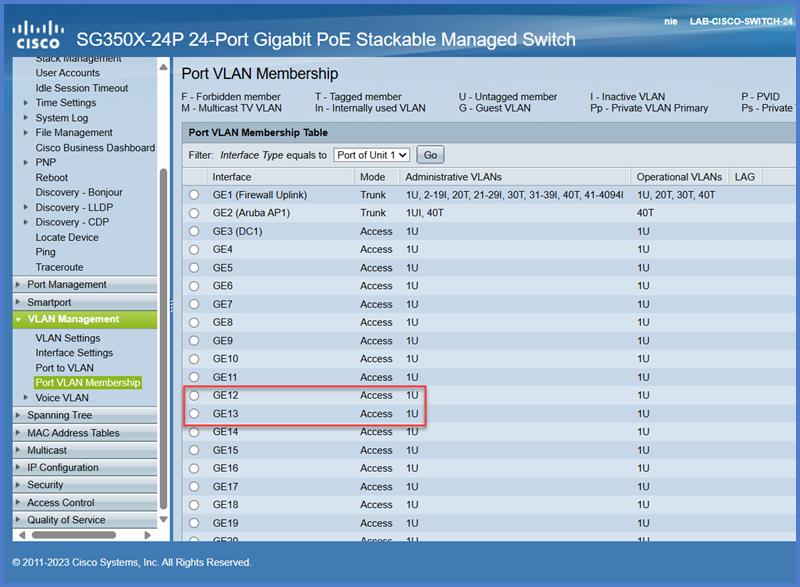

<!-- 
TO DO List

Add a bit more at the beginning for "restoring your configuration"

Update Jinja for PC01 / PC02? Name, User, Password

 -->


<!-- # ⚠️WARNING:⚠️ This Lab is not ready for use yet.

**We are still working on this lab, please check back at another time. We should be done by next week!**

⚠️🔧🔒⚠️🔧🔒⚠️🔧🔒⚠️🔧🔒⚠️🔧🔒⚠️🔧🔒⚠️🔧🔒⚠️🔧🔒⚠️🔧🔒⚠️🔧🔒⚠️
 -->

# Lab 2: Adding Devices to our Network

In this lab, you will work to restore a switch using your previous lab config file, you'll add additional endpoints to the network, test connections using the `ping` network utility, and test your VLAN tagging knowledge!


## Prerequisites  

- Familiarity with VLAN concepts and switch port configurations.  
- GUI access to a managed switch.  
- Two Endpoint devices - You may use your laptop as well as PC01 (bottom shelf of rack).

---

## Required Equipment  

- Managed switch (e.g., {{ extra.devices.cisco_switch.type }}).  
- Endpoints for connectivity testing.  
- Browser-based GUI access to the switch.

---

!!! tip "Key Concepts"
    VLAN tagging separates network traffic into logical segments, improving {{ vlans.security.name }} and performance.  
    You'll also be working with the following VLANs:
    
      
    - **{{ vlan.name }}**: {{ vlan.description }} ({{ vlan.subnet }})  
    

---

## Task 1: Restore the Switch Configuration from Backup  

!!! question "Why Restore Configuration?"  
    Restoring a configuration ensures your switch has the desired settings without manually reconfiguring everything.

### Steps  

1. **Access the Switch GUI**  
    - Open your browser and navigate to the management IP: `{{ extra.devices.cisco_switch.default_ip }}`.  
    - Use the credentials below:  
        - Username: `{{ extra.devices.cisco_switch.default_user }}`  
        - Password: `{{ extra.devices.cisco_switch.default_pass }}`  

!!! tip "Don't forget your NIC adapter settings. Revisit the [cisco setup guide](cisco-switch-setup.md) if you need a refresher."

2. **Locate Backup/Restore Settings**  
    - Navigate to `Administration → File Management → File Operations`.  
    - Select the **Update File** option.

3. **Upload Backup File**  
    - Choose the backup file from your local machine or your USB inserted into the switch.  
    - Choose **Running Configuration** for the destination.  
    - Click **Apply** and confirm the restore process.

4. **Reconnect to Switch**  
    - **Update** your **NIC settings** and **reconnect** to the switch with:  
        - IP Address: `{{ devices.cisco_switch.ip }}`  
        - User: `{{ devices.cisco_switch.custom_user }}`  
        - Password: `{{ devices.cisco_switch.custom_pass }}`

!!! tip "Save Your Work"  
    After restoring the configuration, ensure you save it to the startup configuration.  

---

## Task 2: Connect More Endpoints  

1. **Turn on PC01 and Sign In**  
    - Plug **Power** into **PC01**.  
    - Plug in the **Display Cable** between **PC01** and the monitor.  
    - Plug the **Ethernet** cable into **PC01** and into `GE13` _(bottom-left)_ of **{{ devices.cisco_switch.name }}**.  
    - Sign into **PC01** with the following credentials: `(LabAdmin/Password)`.

2. **Update Network Settings**  
    - Update the NIC so that it can communicate with the switch.  
    - Set the IP Address within the {{ vlans.lan.name }} subnet _({{ vlans.lan.subnet}})_. This exercise will use `192.168.10.13` for this example, feel free to use the same and follow along.

---

## Task 3: CMD and Conquer  

Let's run some quick tests to confirm our setup so far by launching the **Windows Terminal**. Command Prompt (CMD) will suffice as well, but **Windows Terminal** allows us to run commands in **many** shells _(Command Prompt, PowerShell, Windows Subsystem for Linux)_, not just CMD.*

### **What's my IP?**  
- Press `WIN + X` and select **Terminal**.  
- Type `ipconfig` and hit **Enter**.  
    - **Verify** the Ethernet Adapter has the proper **IPv4** and **Subnet Mask** configured.

### **Ping the Switch**  

!!! tip "Can you hear me now?"  
    The `ping` command is one of the most commonly used network utilities for troubleshooting. This command sends a series of network packets to a designated IP or host in order to check if they can "talk" to one another. It's mostly used to verify that another device is online, and that the devices can establish a connection between one another.

    💡**Tip:** By default `ping` only sends 4 packets then stops, but using `ping -a` creates a **rolling ping** that runs continuosly until stopped with `ctrl+c`. This can be helpful when rebooting a server as it allows you to start a rolling ping against it to monitor the reboot progress and verify when it's back up.

    [📚Read more about Ping](https://learn.microsoft.com/en-us/windows-server/administration/windows-commands/ping)

- In the **terminal**, type `ping {{ devices.cisco_switch.ip }}` and hit **Enter**.

If you were successful, then you should see 4 packets sent successfully to the switch. Each reply gives you the amount of time in milliseconds _(ms)_ that it took to send a packet to the switch and receive an "alive" response. 

```
C:\Users\LabUser>ping 192.168.10.2

Pinging 192.168.10.2 with 32 bytes of data:
Reply from 192.168.10.2: bytes=32 time=2ms TTL=64
Reply from 192.168.10.2: bytes=32 time=4ms TTL=64
Reply from 192.168.10.2: bytes=32 time=3ms TTL=64
Reply from 192.168.10.2: bytes=32 time=5ms TTL=64

Ping statistics for 192.168.10.2:
Packets: Sent = 4, Received = 4, Lost = 0 (0% loss),
Approximate round trip times in milli-seconds:
Minimum = 2ms, Maximum = 5ms, Average = 3ms
```

- From **{{ devices.cisco_switch.name }}** try to `ping` your other device by it's IP address.

If your switch and endpoints are configured correctly then you should be able successfully to ping one another. 

!!! warning
    `ping`, also known as **ICMP** traffic, may sometimes be blocked on purpose. Administrators may not want you to know if their infrastrucutre responds to the outside world. As useful as `ping` is, it can also be equally descrutive when used maliciously. So while generally you can use it to test connectivity, please know that it's not 100% accurate as the other device may have ICMP disabled or a device's built-in firewall may block it. 

## Task 4: Verify Configuration and Test

Now that you have the endpoints connected, we will configure VLANs on the switch to segment traffic between different logical networks. If you restored from a baseline then you likely have these already configured, but never hurts to **verify explicitly**.

### Steps:

1. **Access the VLAN Configuration Menu**  
      - On the switch GUI, navigate to **VLAN Management → VLAN Settings**.  
      - Review the current VLAN configuration to ensure the necessary VLANs have been created. You should already have the following VLANs configured:

      
      **VLAN {{ vlan.id }} - {{ vlan.name }}** ({{ vlan.subnet }})
      

2. **Test Connectivity through Switch** 
Confirm the following is true about your devices by navigating to 
    - **Your laptop** (`GE12`) should be assigned to the **{{ vlans.lan.name }}** VLAN with an **access port**.  
    - **PC01** (`GE13`) should be assigned to the **{{ vlans.lan.name }}** VLAN with an **access port**.



3. **Ping away**  
      - Both of our devices should be able to communicate with one another, so let's `ping` from your laptop to `PC01`.

```
C:\Users\YourName>ping 192.168.10.13

Pinging 192.168.10.13 with 32 bytes of data:
Reply from 192.168.10.13: bytes=32 time=1ms TTL=128
Reply from 192.168.10.13: bytes=32 time=1ms TTL=128
Reply from 192.168.10.13: bytes=32 time=1ms TTL=128
Reply from 192.168.10.13: bytes=32 time=1ms TTL=128

Ping statistics for 192.168.10.13:
    Packets: Sent = 4, Received = 4, Lost = 0 (0% loss),
Approximate round trip times in milli-seconds:
    Minimum = 1ms, Maximum = 1ms, Average = 1ms
``` 

Hopefully your ping was successful too! Some common issues may be switch configuration, Windows firewall blocking ICMP, and never forget to double check your cables even if you think you plugged everything in correctly!


4. **Break the Connection**

    We know we have a connection established, but let's try to test our VLAN knowledge and break the connection! Let's pretend **PC01** is a security camera server and needs to be **isolated to the {{ vlans.security.name }} VLAN**.
    
    - Navigate back to **{{ devices.cisco_switch.name }}** and update `GE13` so that the access VLAN is `{{ vlans.security.id }}` and **apply** your changes.

    !!! question "Think about it"
        What did we just do?
        ---
        Currently **PC01** is plugged into `GE13` as an **access** port so it can only communicate on one VLAN, which we've now updated to VLAN `{{ vlans.security.id }}`. So in theory, **PC01** can only communicate on the `{{ vlans.security.subnet }}` network now.

        What's going to happen when we `ping` the switch? Will it still work? We're still directly plugged into it!

    - From **PC01** try to `ping` **{{ devices.cisco_switch.name}}** on {{ devices.cisco_switch.ip }}
    
    <br>

    **Did you guess right?**
  
    - **PC01** can only communicated on the `{{ vlans.security.subnet }}` network, but **{{ devices.cisco_switch.name}}** is not in that subnet, and therefore can't communicate. Additionally, even if we _could_ communicate, we never updated our NIC settings on **PC01**. 

    <br>

    You could go update the NIC on **PC01** to be in the correct subnet, but it would be no help in this current lab. To communicate between VLANs we need something to route those requests on the Layer 3 network. Something like a **{{ devices.firewall.name }}**! We'll come back to VLANs once we get out firewall configured next.

---

## Task 5: Cleanup and Final Verification

1. **Save Configuration**  
    - Once you are done testing, ensure that you save the configuration to the startup configuration on the switch to preserve your changes.

2. **Reset Equipment to Factory Defaults**
    - Ensure {{ devices.cisco_switch.name }} has been factory reset and is ready for the next lab user.

3. **Power Off Devices**
    - Take a moment to power down **PC01** gracefully. The remaining hardware can be turned off via the single Red power toggle on the PDU.

4. **Clean Up and Organize**
    - Please take a moment to organize the cables and equipment you used for this lab. Please ensure it is cleaned up and ready for the next user. 