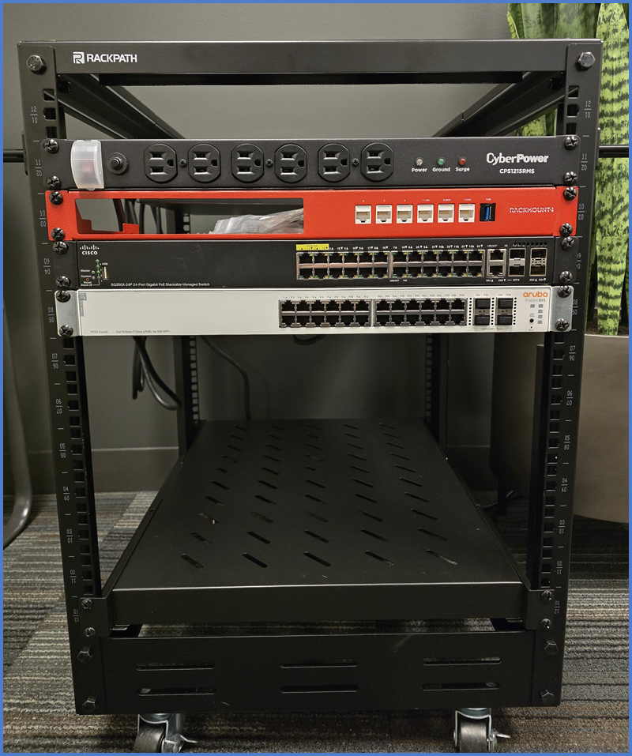

# Networking Lab Overview  

Welcome to the **Networking Lab**—a hands-on environment designed to help you sharpen your networking skills and explore NIE’s operations in a controlled, safe space. From configuring firewalls and switches to implementing VLANs for VoIP or troubleshooting network issues, this lab empowers you to experiment freely. Reset configurations and practice as much as you like!  

!!! tip "Test, Test, and Test Again!"  
    This is your **safe space to fail and learn**, so step outside your comfort zone and dive in! Here you can make changes without fear of bringing down the network or causing unexpected issues. Go ahead—break it and figure out how to fix it!

---

## Lab Setup Overview 🛠️  

Our lab is housed in a compact, rolling 12U rack that can be easily moved to your desk or a dedicated **lab bench**. Here's what you'll find in the rack:  

### Equipment in the Rack  
- **PDU (Power Distribution Unit):** Powers all devices in the rack.  
- **WatchGuard T45:** Firewall for network security and routing.  
- **Cisco SG350X-24P:** Managed switch for core network configurations.  
- **Aruba Instant On 1930-24P:** Secondary switch for extended network setups.  
- **Aruba Instant On AP22:** Wireless access point for Wi-Fi connectivity.  
- (Planned) **Raspberry Pi with Windows Server & ADDS:** A versatile server for labs involving Active Directory.  

  

---

## How to Use the Lab  

1. **Position the Rack**  
    - Move the rack to your desk or the **lab bench**.  
    - Ensure it’s stable and positioned conveniently.  

    !!! tip "⛔ Do Not Disturb ⛔"  
        While the lab is not overly noisy when running, please be sure not to disturb your teammates. If you are sitting next to someone, ask if they mind. Otherwise, feel free to move to a hoteling desk or the bench in the back!  

2. **Power It On**  
    - Plug the single **PDU power cable** into a wall outlet.  
    - Power on the required devices as per the lab instructions.  

    _**Note:** You may need to open the plastic cover and flip the red master switch on the PDU._  

3. **Connect Your Laptop**  
    - Use the provided **blue Ethernet cables** to connect your laptop to the lab. The specific lab will give you more information on how to get connected.  

    !!! danger "Connecting the Lab to Internet"  
        **Internet Access:** If the specific lab calls for Internet, please be sure to connect the firewall WAN into the dedicated **Lab Network** port in the back room! **Please do NOT plug any part of the lab into the existing corporate network.**  

4. **Save Your Work**  
    - Use a **USB drive** to store lab files.  
    - Alternatively, save them to **OneDrive** if you're working on the labs on your device.  

5. **Clean Up**  
    - Remove **blue cables** connecting your laptop or other endpoints.  
    - Leave the infrastructure connected _(e.g., switches, firewall, AP)_.  
    - Power off devices and neatly organize cables. Leave the rack ready for the next person!  

6. **Report Issues**  
    - If you encounter any problems, contact [it@networkiteasy.com](mailto:it@networkiteasy.com) for assistance.  

 
This lab is here to support your growth—have fun experimenting and learning! If you have any questions or feedback, please let us know!