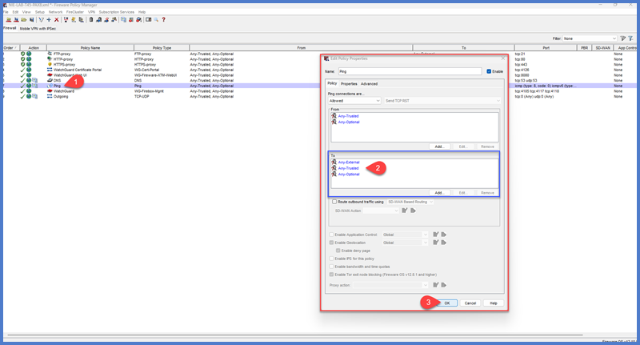

<!-- 
Thigns To Do:

 -->

# WatchGuard Firewall Lab Guide

## Pre-Requisites
- A computer with an accessible Ethernet port
- WatchGuard System Manager (WSM) installed on a PC
- {{ devices.firewall.type }} or other WatchGuard Firewall model
- A location to store your configuration files
- 🌐 Internet Access - **be sure to use the Lab WAN for Internet** 

---

## Power On and Get Connected
1. Power on the Network Rack and ensure devices have power.
2. Plug cable into **LAN** (port 1) of the {{ devices.firewall.type }} and into your NIC.
2. Plug the dedicated **Green LAB WAN Uplink** cable into the **WAN** (port 0) of the {{ devices.firewall.type }}.
2. WatchGuard provides a DHCP server by default (`{{ devices.firewall.default_subnet}}`) so make sure your **NIC is set to DHCP** or within the subnet. _May need to disable docking station NIC if you're also uplinked through it._
3. Run `ipconfig` to check if you received an IP in the subnet.
4. Default login: `{{ devices.firewall.default_web_address}}`.
    - Your browser may block the connection due to SSL certificate: click **Advanced** and **Continue** to {{ devices.firewall.default_web_address}} (unsafe) to get to GUI.
    - Credentials: defaults are `{{ devices.firewall.default_admin_account }}`.

    !!! note "Resetting WatchGuard Firewall"
        The previous lab user(s) should have reset the firewall when finished, but if they did not, it's a quick process to do. Please jump to the end of this guide to the [final steps](#final-steps) portion to wipe the firewall. Once done, then please continue from this step.

---

## Setup Wizard
1. **Create New Configuration** and **accept terms**.
2. **Configure External Interface**:
    - Use Interface 0 for WAN.
    - Static IP:
        - Public Static: `{{ wan.ip }}{{wan.cidr }}`
        - Gateway: `{{ wan.gateway }}`
    - Click **Next**.
    - Domain name: `{{ vlans.lan.domain_name }}`.
    - DNS servers: 
        - `1.1.1.1` (CloudFlare) 
        - `8.8.8.8` (Google).
        - **Note:** If you are not plugged into Internet then this will fail, but you can still continue on.
    - Click **Next**.
3. **Configure Trusted Interface**:
    - Leave defaults as we'll update them later in the lab. For now, the defaults create a DHCP server to get an IP and log into the firewall.
4. **Update Passwords**
    - `{{ devices.firewall.custom_status_account }}`
    - `{{ devices.firewall.custom_admin_account }}`
5. Click **Next**.
6. **Update** System Settings:
    - Name: `{{ devices.firewall.name }}`.
    - Location: `{{ office.location }}`.
    - Contact: `{{ office.contact }}`.
7. **Set Time Zone**: `GMT-6:00 Central Time US and Canada`.
8. Click **Next**.
9. **Skip Feature Key** for now.
10. Review information and click **Next**.

You can close out of the browser once finished.

---

## Connecting with WatchGuard System Manager (WSM)
_If you don't have WatchGuard System Manager (WSM) already installed, download it from [WatchGuard Downloads]({{ devices.firewall.software_download }})._

1. Launch WatchGuard System Manager from your computer.
2. Go to **File > Connect to Device**:
    - **IP Address:** `{{ devices.firewall.default_ip }}`.
    - **Credentials:** `{{ devices.firewall.custom_status_account }}`
3. Right-click the device and open **Policy Manager**.
4. Take a moment to review the information we previously configured.
    - Go to **Setup > System** and confirm the information is correct. If something is incorrect, now is the time to update it!
5. **Update the Feature Key**
    - From Policy Manager open **Setup > Feature Key**
    - **Download** the feature key from the web. If it does not work, then you can manually **import** the key located in the [lab files]({{ urls.lab_files}}) and within the Firewall baselines folder. 
5. **Upgrade Firmware**:
    - You can **check the current firmware version** back from the main WSM window. While connected to the firewall, you'll see at the end of the name is _[Fireware OS v.12.10...]_ indicating the current version.
    - Download new firmware if an upgrade is needed: [WatchGuard T45 Software](https://software.watchguard.com/SoftwareDownloads?current=true&familyId=a2R6S00000537cVUAQ).
        - Install it on your machine _(simple "next, next" installer)._
    - Go to **File > Upgrade**:
        - Save the current config in the default location for now.
        - Sign in with admin credentials.
        - Browse to the firmware file if it didn't automatically locate it. If there’s a popup saying no files, ensure you’ve installed the `.exe` firmware.
        - Click **OK**, then **Yes**, and wait for it to finish _(about 3 minutes)_.
        - **Re-Open** the updated configuration file when finished. 

---

## Create Temporary Network

1. **Configure a Temporary Port**:  

    !!! question "Why are we making a temporary network?"
        Unlike the cisco switch, you can make changes in policy manager without updating the "running configuration". **In order for changes to take effect they must be saved to the firewall.** That means this step is technically unneccessary _(and we would never do this at a customer!)_, but by creating a temporary network we'll have a "Get out of jail free card" for our labs that we can use to get back into the firewall incase we have a mistake in our configuration. It also gives you another opportunity at configuring interfaces.🎉🎊

    - Go to **Network > Configuration**:
        - Double-click **Interface 4** to configure.
        - Select **Trusted** type from the dropdown.
        - **Name** the interface: `Temp Network`.
        - **Set IP**: `192.168.199.1/24`.
        - **Add** a DHCP server:
            - Starting IP: `192.168.199.100`.
            - Ending IP: `192.168.199.110`.
        - Click **OK**, then **OK** again.
    - Save changes (**File > Save > To Firebox**):
        - Provide **admin credentials** _(`{{ devices.firewall.custom_admin_account }}`)_ and click **OK**.
        - WatchGuard stores config files in your documents. **Save the config** here temporarily. At the end of the lab, we'll make a final baseline backup to store in your permanent lab files.
    - **Close** the policy manager window and **disconnect** from the firewall in WSM by right-clicking the device.
2. **Test New Interface**:
        - **Move** your ethernet connection into **Interface 4** of the WatchGuard instead of Interface 1.
        - **Confirm** you received a new **IP via DHCP** in the temp network by using the `ipconfig` command.
            - Troubleshoot the connection if not (check your adapter settings, reset the connection, etc.) Running an `ipconfig /renew` may help to force a new IP from DHCP as well.

---

## Adding VLANs to Firewall

1. Reconnect to the Firebox on the temp IP (`192.168.199.1`):
    - WSM > Connect to Firebox > Sign in.
    - Launch **Policy Manager**.
    - **Configure Interface 1**:
        - Go to **Network > Configuration**.
        - Click on the **VLAN** tab and add the **{{ vlans.lan.name }}** network:

            | **VLAN Name** | **VLAN ID** | **Subnet**         | **Default Gateway** | **DHCP Server**       | **DHCP Range**          |
            |---------------|-------------|--------------------|---------------------|-----------------------|-------------------------|
            | {{vlans.lan.name}} | {{vlans.lan.id }} | {{ vlans.lan.subnet }} | {{vlans.lan.gateway}} | Firewall | {{vlans.lan.dhcp_range}} |

            - **Name:** `{{ vlans.lan.name }}`
            - **Security Zone**: `Trusted`
            - **VLAN ID**: `{{ vlans.lan.id }}`
            - **IP Address**: `{{ vlans.lan.gateway }}{{ vlans.lan.cidr }}`
            - **DHCP Server**: Check `Use DHCP Server`
                - Click **Add** and **set** the **starting and ending IP** addresses `({{ vlans.lan.dhcp_range }})`
            - Click **OK** once finished.

        

        Now you can **add** the **remaining VLANs** below using the same methods. **A couple caveats to be aware of though**:

        - The **IP Address** is a combination of the Default Gateway + the size of the subnet in CIDR notation _(meaning `/24` or similar)_
        - Only add a **DHCP server** to the VLAN if the **Firewall** is specified for the particular VLAN, otherwise leave it disabled for the VLAN.
        - For the **GUEST and SECURITY VLANs**, set the security zone to **Custom** instead of **Trusted**. By default, trusted interfaces would typically allow and route traffic by default and we want to ensure **we** determine what routes to these VLANs via future policies.

            | **VLAN Name** | **VLAN ID** | **Subnet**         | **Default Gateway** | **DHCP Server**       | **DHCP Range**          |
            |---------------|-------------|--------------------|---------------------|-----------------------|-------------------------|
            
            | {{ vlan.name }} | {{ vlan.id }} | {{ vlan.subnet }} | {{ vlan.gateway }} | {{ vlan.dhcp_server | default("Not Assigned") }} | {{ vlan.dhcp_range | default("Not Defined") }} |
            

    
 

    **Update Interface after VLANs have been added:**  

    - **Double-click** on `Interface 1`.
    - **Update** the **dropdown** to `VLAN`.
    - **Update** the **name** to `Trusted VLANs`.
    - **Configure** the **untagged VLAN** checkbox to `{{ vlans.lan.name }}` (at the bottom):
    - **Tag** the other **remaining VLANs** using the checkbox at the top so that the main LAN port can pass all VLANs through to the switches. **Do NOT tag the main LAN**.
    - Click **OK**, then **OK** again.

## Adjust Default Ping Policy

Like we mentioned in the previous lab, `ping` can be a great network utility for troubleshooting and verifying network connectivity! However, WatchGuard's built in policy for **ping traffic** allows it to work a little _too well_, which can lead to some confusing results in future labs. We'll scope this specific policy in a bit so that it still works and is helpful, but won't lead us down the wrong path with "false positives" in later troubleshooting. 

1. **Open** the Default Policy named **Ping** by **double-clicking** it or right-clicking and Modify Policy.
2. In the **To** box, remove **Any**. 
3. In the **To** box, add the following: **_Any-Trusted, Any-External, Any-Optional_**
4. Hit **OK** to save the policy changes.

---

## Save and Verify Network Changes

1. Save our changes to the firewall with **File > Save > To Firebox**.
    - **Authenticate** as the admin user
    - You may say **Yes** to warnings about overwriting the file
2. After the save is successful, **move** the cable back to **Eth 1**.
3. Run `ipconfig /renew` to confirm you received a proper IP from DHCP within the **{{ vlans.lan.name }}** subnet _({{ vlans.lan.subnet }})_.

If you are successful, then you're all set to save our baseline configuration for future labs!

---

## Final Steps
1. **Backup Baseline Configuration**:
    - Go to **File > Save > As File**. You may need to disconnect and reconnect to the firewall in WSM since we've made network changes.
    - **Save** with a descriptive name, e.g., `baseline_watchguard_firewall.xml`.
    - Store in your lab files (e.g., OneDrive or USB).
3. **Wipe Firewall for Next User**:  
    Once you're all done, be sure to reset the firewall for the next lab user. For {{ devices.firewall.type }} models, follow these steps to factory reset:
    - **Power off** the Firebox using the switch located on the back.
    - **Press and hold** the **Reset** button _(next to power)_.
    - **While holding** the reset button, **power on** the Firebox.
    - **Continue holding** the button until the **ATTN** indicator begins to flash _(about 20 seconds)_.
    - **Release** the reset button but do not power off the Firebox.
    - **Wait** for the reset process to complete _(up to 70 seconds)_. The **ATTN** indicator will stay lit.
    - OPTIONAL: **Reboot** the firewall. Since we're putting this away for the next user this step is not needed at this time, however, if you were resetting the firewall and continuing to use it in this lab session you will need to reboot once it's back up. The firewall will be operational once it comes up after this reboot.
    
    The firewall has been reset. You can confirm this by running an `ipconfig` and verifying the IP you were given is within the default subnet of {{ devices.firewall.default_subnet }}.

---

Great work!🎉 

You now have a baseline configuration for the firewall. There's still more work we need to do, and we need to connect it to Internet to update our feature key and unlock subscription services. We'll pick up from here in future labs, but in the meantime feel free to review [NIE's technical documenation](https://nie.itglue.com/3451640/docs/6433440) that our Field team uses when they prep new firewalls.